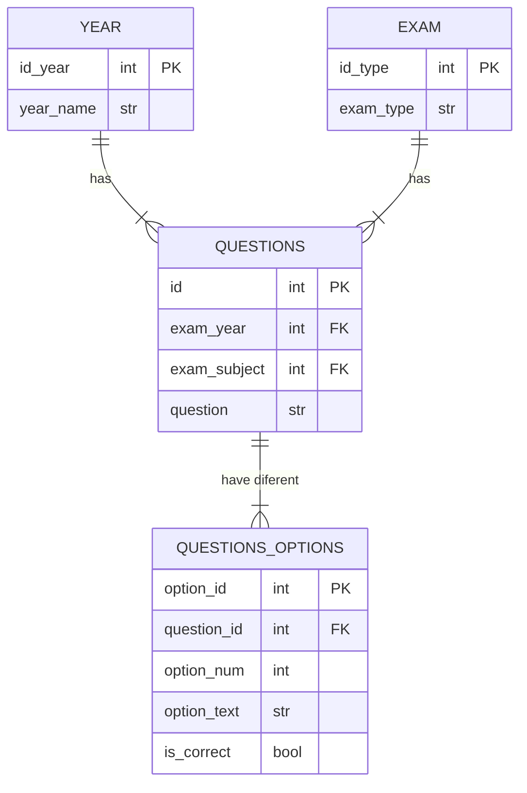

# ETL from pdf files 👷🏼 (WIP)

This project automates the extraction of questions from the Exams for Internal Resident PDFs found on the "Ministerio de Sanidad" site and it's corresponding answers sheet, cleans them, and loads the data into CSV, SQLite, and Anki formats, all in under 5 minutes per PDF, saving you valuable time.

## Summary

## Table of Contents

* [Motivation](#motivation)
* [Technologies and Tools Used](#technologies-and-tools-used)
* [Project Architecture](#project-architecture)
    * [Initial considerations](#initial-considerations)
    * [Extract](#extract)
    * [Transform](#transform)
    * [Load](#load)
* [Instalation and Usage](#instalation-and-usage)
* [What I Learned](#what-i-learned)
* [Potential Improvments](#potential-improvments)

## Motivation

As a self-studying candidate for the Internal Resident in Biology (BIR) exam, I faced the daunting task of efficiently reviewing a vast number of exam questions in PDF format. The tedious process of manual review quickly became a significant hurdle. To overcome this, I developed an ETL pipeline to automate the extraction and organization of these questions, seamlessly integrating them into Anki for streamlined and effective study sessions. This project transformed my exam preparation from a laborious chore into a personalized and efficient learning experience. For this, I explored various PDF text extraction methods and selected the open-source `pypdf` library for its user-friendly nature. Data manipulation and cleaning were accomplished using `pandas`, the gold standard in Python's data science ecosystem.

## Technologies and Tools Used

This project leverages the following technologies and tools:

* **Programming Language:** Python 3.12
* **Development Enviroment:** Jupyter Notebooks - Used for interactive development.
* **PDF Extraction**: PyPDF 5.3.0 - Used to extract content from PDF files.
* **Data Manipulation**: Pandas 2.2.2 - Used for data cleaning and transformation.
* **Data Manipulation**: Numpy 1.26.4 - Used for data cleaning.
* **Database:** SQLite3 - Used to store data in a relational database.
* **Anki Integration:** Anki Connect - To connect with Anki using an API.

## Project Architecture

### Initial considerations

Early in the development process, I encountered several challenges related to the variability of the PDF files. Each PDF presented unique issues, including:

* **Artifacts:** Page numbers and other elements often appeared as artifacts within the extracted text, requiring careful filtering and removal. For example, some PDFs consistently placed page numbers within the content area, while others had inconsistent placement.
* **Truncated Lines:** Questions were often split across multiple lines due to the two-column format of the original PDFs. These truncated lines needed to be intelligently joined to ensure accurate parsing and interpretation. Some common patterns included hyphens at the end of lines and inconsistent spacing between words.

Furthermore, I discovered two distinct answer sheet formats used in the exams, each requiring a different parsing approach. The exams from 2024 to 2018 had answer files in TSV format, structured in six pairs of columns with the column names "V" and "RC." The exams from 2017 and earlier had answers in TXT files, separated by spaces, with the following schema: one row for the question number and the row below for the correct option. Another difference between the two answer formats was that, in the TSV files, annulled questions were marked with missing values, whereas in the TXT files, they were marked with the letter "A." To address this, I developed two separate templates to accommodate these variations.

Finally, the number of answer options changed from five to four starting in 2015. This meant that I needed to create a third template to handle exams from 2015 onwards.

These challenges highlighted the need for a flexible and adaptable solution capable of handling the nuances of different PDF formats and exam structures. The main logic for extracting the exam questions was the same for all exams, with only minor modifications to remove certain artifacts. For the answers, I implemented two distinct methods to parse and slice the data, using `pandas` DataFrames to create a consistent two-column format, one with the question number and the other with the correct option, ensuring accurate extraction and processing of the exam questions.

I also decided to implement a function to compute the expected number of rows depending on the exam year, since different years have different numbers of options and questions. This function uses a dictionary to determine the expected count. The extracted data is then validated by comparing the actual number of rows with the expected number. If there's a mismatch, an error is raised to alert the user of potential data extraction issues.

### Extract

The extraction process begins by reading the exam PDF using the open-source `PyPDF` library. `PyPDF` parses the PDF excluding the first one or two pages, and the resulting text is then piped into a `pandas` DataFrame for further processing.

The answer sheets are handled differently depending on their format. Exams from 2024 to 2018 use TSV files, while exams from 2017 and earlier use space-separated TXT files.

The extraction of booth types of formates is udes using `pandas` `read_table` method, but adjusting the separator 

### Transform

The questions using pandas will remove all the artifacts, like page numbers or others, and white spaces. Once all artifacts are gone a function to deal with multines will be used, it checks if a line ends with "-" for truncated words and to detect if the next line is a question or options the function checks if the first element of the next line can be converted into an integer.

Once this script is done it counts the number of lines that do not end with a dot, comma or interrogation and generates a list of ids to fix. The length lf this list will be compared with the theoretical number of incorrect rows that is calculated with the following formula number of questions * number of options - length of the dataframe. If the number of expected errors matches with the length of ids to fix it applies a second function to fix them, if there are more or less than expected prints +/- 2 rows for context and raises a Warning, so i could manualy check for the rows to fix.

Another check is done once the fix is applied and if the number of rows is not equal to the expected it raises a Warning to check it manually.

Once all the checks are done the dataframe is pivoted to get the following columns: 

* Question
* Options columns ranging from 1 to 4
* Option 5 if needed

For the anwers dataframe the transform step it will depend if it comes from tsv file or txt.

### Load

#### csv files

The clean data was first saved to individual csv files, as a backup, and to fix spacing issues like "T h i s  i s  a n  e x a m p l e" that were faster and easier to fix in a csv file and then from the csv file read it with pandas and load into the database

Finally once all the data was stored in the database before loading the data into Anki it was saved into a csv file containing all the exams.

#### SQLite3
Database Schema

Porque esta schema

#### Anki

The Anki deck can be found either in the data/clean folder or in [AnkiWeb](https://ankiweb.net/shared/info/1201513810?cb=1741110674865)

Each card has the following structure:
* Year number and three leter abreviation of the exam for easy identification of the question
* Quesion statement followed by three line breaks for easy redability
* Quesion options with two line breaks in between options for easy redability

The target tags have the following hierarchy:
* "Examenes" as the parent tag 
    * Exam Type (BIR, FIR, QIR, MIR)
        * Exam Year (2024 - 2005)

## Instalation and Usage

## Example output

### Raw DataFrame extracted from PDF files:

### Clean DataFramse with answers:

### In Anki:

### In csv file:

### In SQLite3 database: 

Question Table

Options table

## What I Learned

* Cuando escribes a una db añadir suficientes constraints, ya que si dos preguntas tienen el mismo enunciado puede causar problemas, asi que añadir mas constraints como año o tipo de examen.
* Use pandas and numpy to manipulate and clean data.
* Implement validation steps in the pipeline.

## Potential Improvments

* A better heuristic or a new way to detect and fix truncated lines so there is no need for manual checking.