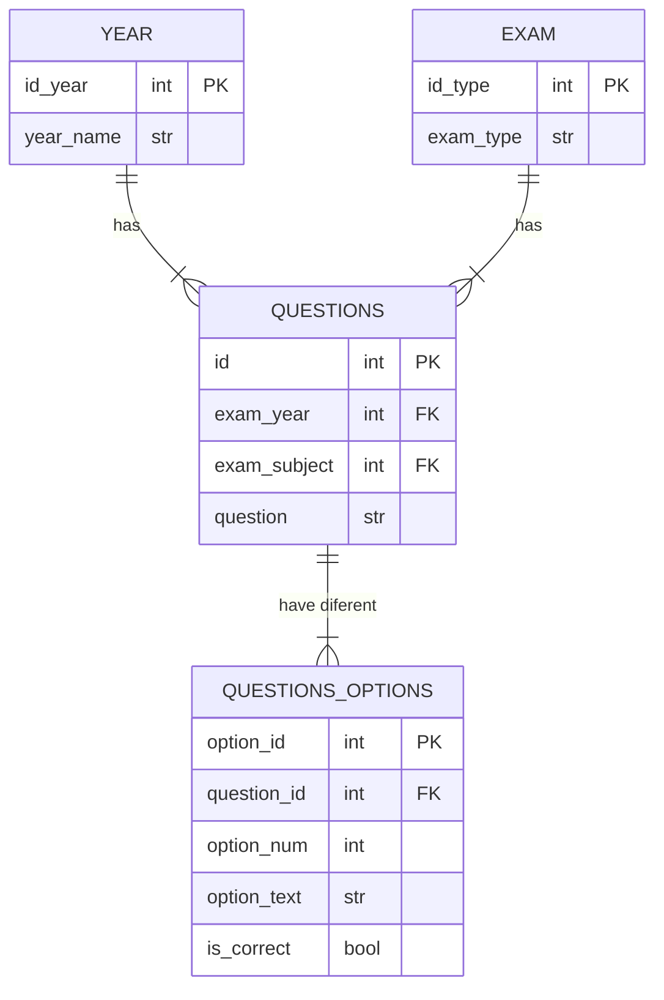
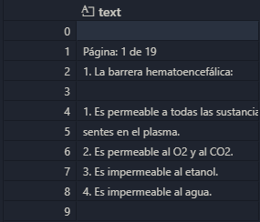
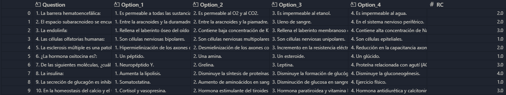
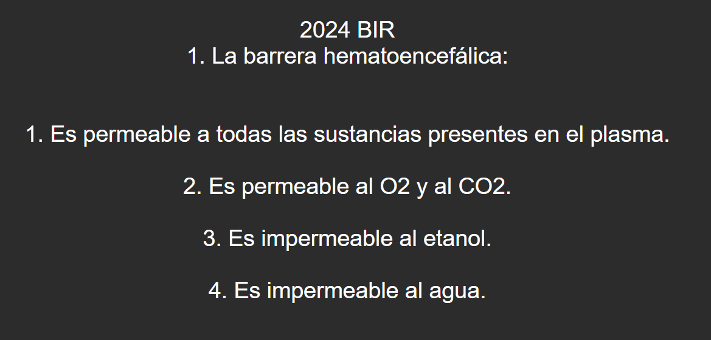
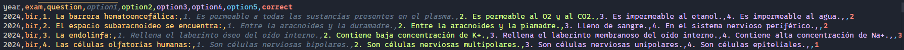
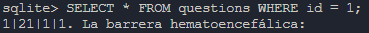
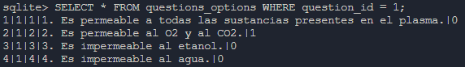

# Transform PDFs to Anki Cards: A Comprehensive Pipeline for Question Extraction

This project automates the extraction of questions from the Exams for Internal Resident PDFs found on the Ministerio de Sanidad site and it's corresponding answers sheet, cleans them, and loads the data into CSV, SQLite, and Anki formats, all in under 5 minutes per PDF.

## Summary


## Table of Contents

* [Motivation](#motivation)
* [Technologies and Tools Used](#technologies-and-tools-used)
* [Project Architecture](#project-architecture)
    * [Initial considerations](#initial-considerations)
    * [Extract](#extract)
    * [Transform](#transform)
    * [Load](#load)
* [Instalation and Usage](#instalation-and-usage)
* [What I Learned](#what-i-learned)
* [Potential Improvments](#potential-improvments)


## Motivation

As a self-studying candidate for the Internal Resident in Biology (BIR) exam, I faced the daunting task of efficiently reviewing a vast number of exam questions in PDF format. The tedious process of manual review quickly became a significant hurdle. To overcome this, I developed an ETL pipeline to automate the extraction and organization of these questions, seamlessly integrating them into Anki for streamlined and effective study sessions. This project transformed my exam preparation from a laborious chore into a personalized and efficient learning experience. For this, I explored various PDF text extraction methods and selected the open-source `pypdf` library for its user-friendly nature. Data manipulation and cleaning were accomplished using `pandas`, the gold standard in Python's data science ecosystem.

## Technologies and Tools Used

This project leverages the following technologies and tools:

* **Programming Language:** Python 3.12
* **Development Enviroment:** Jupyter Notebooks - Used for interactive development.
* **PDF Extraction**: PyPDF 5.3.0 - Used to extract content from PDF files.
* **Data Manipulation**: Pandas 2.2.2 and Numpy 1.26.4 - Used for data cleaning and transformation.
* **Database:** SQLite3 - Used to store data in a relational database.
* **Anki Integration:** Anki Connect - To connect with Anki using an API.

## Project Architecture

### Initial considerations

Early in the development process, I encountered several challenges related to the variability of the PDF files. Each PDF presented unique issues, including:

* **Artifacts:** Page numbers and other elements often appeared as artifacts within the extracted text, requiring careful filtering and removal. For example, some PDFs consistently placed page numbers within the content area, while others had inconsistent placement.
* **Truncated Lines:** Questions were often split across multiple lines due to the two-column format of the original PDFs. These truncated lines needed to be joined to ensure accurate parsing and interpretation. Some common patterns included hyphens at the end of lines and inconsistent spacing between words.

Furthermore, I discovered two distinct answer sheet formats used in the exams, each requiring a different parsing approach. The exams from 2024 to 2018 had answer files in TSV format, structured in six pairs of columns with the column names "V" and "RC." The exams from 2017 and earlier had answers in TXT files, separated by spaces, with the following schema: one row for the question number and the row below for the correct option. Another difference between the two answer formats was that, in the TSV files, annulled questions were marked with missing values, whereas in the TXT files, they were marked with the letter "A." To address this, I developed two separate templates to accommodate these variations.

Finally, the number of answer options changed from five to four starting in 2015. This meant that I needed to create a third template to handle exams from 2015 onwards.

These challenges highlighted the need for a flexible and adaptable solution capable of handling the nuances of different PDF formats and exam structures. The main logic for extracting the exam questions was the same for all exams, with only minor modifications to remove certain artifacts. For the answers, I implemented two distinct methods to parse and slice the data, using `pandas` DataFrames to create a consistent two-column format, one with the question number and the other with the correct option, ensuring accurate extraction and processing of the exam questions.

I also decided to implement a function to compute the expected number of rows depending on the exam year, since different years have different numbers of options and questions. This function uses a dictionary to determine the expected count. The extracted data is then validated by comparing the actual number of rows with the expected number. If there's a mismatch, an error is raised to alert the user of potential data extraction issues and remaining artifcats.

### Extract

The extraction process begins by reading the exam PDF using the open-source `PyPDF` library. `PyPDF` parses the PDF excluding the first one or two pages, and the resulting text is then piped into a `pandas` DataFrame for further processing.

The answer sheets are handled differently depending on their format. Exams from 2024 to 2018 use TSV files, while exams from 2017 and earlier use space-separated TXT files.

The extraction of booth types of formates is udes using `pandas` `read_table` method, but adjusting the separator 

### Transform

The transformation phase focuses on cleaning and structuring the extracted data.

#### PDF Exam

First, `pandas` is used to remove artifacts, such as page numbers and excessive whitespace, from the extracted text. This involves using functions like `str.replace()` and `str.strip()` to clean the text within the DataFrame.

Next, a function is used to handle multi-line questions and answers. This function addresses cases where questions or answers are split across multiple lines.

* It detects truncated words by checking if a line ends with a hyphen ("-").
* It uses a heuristic to determine if the following line is a question or an option. This heuristic checks if the first element of the next line can be converted to an integer. If so, it assumes it's an option or the next question.

To ensure data integrity, a multi-step error detection and correction process is implemented:

1. Error Identification:


    * The number of lines that do not end with a punctuation mark (dot, comma, or question mark) is counted. These lines are considered potentially incomplete.
    * A list of IDs corresponding to these lines is generated.
    * The theoretical number of incorrect rows is calculated using the formula: `number of questions * number of options - length of the DataFrame`.

2. Error Correction:

    * The length of the list of IDs to fix is compared with the theoretical number of incorrect rows.
    * If the numbers match, a second function is applied to fix the errors. This function takes the list of IDs, sorts it in descending order to avoid indexing issues, and concatenates the row below the row with the ID.
    * If the numbers differ, the script prints a few rows (e.g., +/- 2 rows) for context and raises a `Warning`, prompting manual inspection of the rows and then once the incorrect IDs are identified the function to fix it is applyed.

3. Final Validation:

    * After the error correction, a final check is performed. If the number of rows in the DataFrame does not match the expected number of rows, a `Warning` is raised, requiring manual inspection.

Finally, the DataFrame is pivoted to restructure the data. This transformation results in a DataFrame with the following columns:

* Question
* Option 1
* Option 2
* Option 3
* Option 4
* Option 5 (added if needed, depending on the exam format)."

#### Answers Sheet

##### From TSV file

This process is necessary because the TSV answer files are structured with multiple sets of answer columns, which makes direct analysis difficult. To address this, the original and duplicate pairs of columns are extracted into separate DataFrames. Each extracted DataFrame is then renamed to standardize the column names to "V" and "RC," which facilitates subsequent processing by creating a uniform schema ready to be joined with the questions DataFrame. Finally, all DataFrames are concatenated into a single DataFrame, `answers_df_clean`
##### From TXT file

This section focuses on cleaning and transforming the answer key data. The original data requires restructuring to organize question numbers and correct answers into a usable DataFrame. To make a longer DataFrame so it has two columns, it creates two empty lists. It iterates through the rows of the DataFrame in steps of two. For each pair of rows, the values from the first row corresponds to the number of the question, and the values from the second row correspond to the correct option. It then creates a new DataFrame with two columns. Finally, the code sorts the DataFrame by the "V" column. The resulting DataFrame is ready to be joinned to the questions DataFrame.

#### Joining the DataFrames

The final step of the transformation is to join the questions DataFrame and answers DataFrame. This process includes converting the answers column to an integer and adding an extra column named year.

### Load

#### csv files

The cleaned data was initially saved to individual CSV files. This served as a backup and facilitated the correction of spacing issues (e.g., "T h i s  i s  a n  e x a m p l e") that were more efficiently addressed in a text editor. The corrected data was then read back into pandas DataFrames from these CSV files and loaded into the database.

Before loading the data into Anki, a final CSV file containing all the exams was generated from the data stored in the database.

#### SQLite3

The database schema is designed to efficiently store and manage exam questions and their associated data. The key tables and their relationships are as follows:

* year: Stores information about the exam year.
* exam: Stores information about the exam type.
* questions: Stores the actual exam questions, linking them to the year and exam type.
* questions_options: Stores the answer options for each question.

This schema is designed with normalization principles in mind to ensure data integrity and flexibility. A key design decision was the handling of answer options. Since the number of answer options varies between exams (4 or 5 options), instead of creating a fixed number of columns for options in the questions table, the options are stored in a separate questions_options table. 



#### Anki

The Anki deck can be found either in the data/clean folder or in [AnkiWeb](https://ankiweb.net/shared/info/1201513810?cb=1741110674865)

Each card has the following structure:
* Year number and three leter abreviation of the exam for easy identification of the question
* Quesion statement followed by three line breaks for easy redability
* Quesion options with two line breaks in between options for easy redability

The target tags have the following hierarchy:
* "Examenes" as the parent tag 
    * Exam Type (BIR, FIR, QIR, MIR)
        * Exam Year (2024 - 2005)


## Instalation and Usage

1. Clone the repository

```bash
git clone https://github.com/Oddman43/ETL_BIR_Exams
cd ETL_BIR_Exams
```

2. Install requirements

* Using pip

```bash
pip install -r requirements.txt
```

* Using Anaconda (Recomended)

```bash
conda create -n etl_bir
conda activate etl_bir
pip install -r requirements.txt
```

3. Use the templates and follow the steps

The templates can be found in the templates folder. To extract the text from a recent exam (after 2020), use template 1. Copy the file into the scripts folder and follow the steps in the Jupyter Notebook

## Example output

### Raw DataFrame extracted from PDF files:



### Clean DataFramse with answers:



### In Anki:



### In csv file:



### In SQLite3 database: 

Question Table



Options table




## What I Learned

* **Database Constraints:** When designing a database, it's crucial to implement sufficient constraints. I encountered a bug due to duplicate question statements, which could have been prevented by adding more constraints, such as exam year and exam type when inserting rows, to ensure uniqueness.
* **PDF Extraction and Text Data Handling:** This project provided valuable experience in extracting data from PDF files and working with text data, including cleaning and manipulation.
* **Data Manipulation with Pandas and NumPy:** This project provided valuable experience in using pandas and NumPy to manipulate and clean data effectively
* **Pipeline Validation:** Implementing validation steps throughout the ETL pipeline is essential for maintaining data quality and identifying potential errors early in the process.

## Potential Improvments

* **Enhanced Truncated Line Handling:** Implement a more robust heuristic or develop a novel algorithm to accurately detect and automatically correct truncated lines. This would significantly reduce the need for manual checks and improve the pipeline's efficiency.
* **Pipeline Automation:** Further automate the pipeline to process multiple exams in a single run. Currently, each exam is processed separately due to variations in the PDF files. However, with the knowledge gained, it is believed that the pipeline can be enhanced to handle a wider range of PDF file issues automatically.
