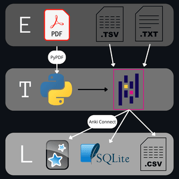

# ETL from pdf files 👷🏼 (WIP)
Avg exam -> 8 mins

Total 34 pdfs

## Summary

## Table of Contents

* [Motivation](#motivation)
* [Technologies and Tools Used](#technologies-and-tools-used)
* [Project Architecture](#project-architecture)
    * [Initial considerations](#initial-considerations)
    * [Extract](#extract)
    * [Transform](#transform)
    * [Load](#load)
* [Instalation and Usage](#instalation-and-usage)
* [What I Learned](#what-i-learned)
* [Potential Improvments](#potential-improvments)

## Motivation

As a self-studying candidate for the Internal Resident in Biology (BIR) exam, I faced the daunting task of efficiently reviewing a vast number of exam questions in PDF format. The tedious process of manual review quickly became a significant hurdle. To overcome this, I developed an ETL pipeline to automate the extraction and organization of these questions, seamlessly integrating them into Anki for streamlined and effective study sessions. This project transformed my exam preparation from a laborious chore into a personalized and efficient learning experience. For this, I explored various PDF text extraction methods and selected the open-source `pypdf` library for its user-friendly nature. Data manipulation and cleaning were accomplished using `pandas`, the gold standard in Python's data science ecosystem.

## Technologies and Tools Used

This project leverages the following technologies and tools:

* **Programming Language:** Python 3.12
* **Development Enviroment:** Jupyter Notebooks - Used for interactive development.
* **PDF Extraction**: PyPDF 5.3.0 - Used to extract content from PDF files.
* **Data Manipulation**: Pandas 2.2.2 - Used for data cleaning and transformation.
* **Database:** SQLite3 - Used to store data in a relational database.
* **Anki Integration:** Anki Connect - To connect with Anki using an API.

## Project Architecture

### Initial considerations

Once I began making some proofs of concept I realised that every PDF file will have diferent issues, from artifacts of page nubmer beeing diferent, to specific problems when dealing with joining truncated lines.

This compounded with the two diferent formatings of the answers sheet meant that i decided to make two templates depending on the format of answeer sheet plus that exams prior to 2015 have 5 options, and from 2015 - 2024 have 4 options meant i needed in total three templates

### Extract

Using the oper source library PyPdf reads the exam pdf and the output is piped into a dataframe

For the answers sheet can be either in tsv format, or txt with spaces as separator. The extraccion is done with Pandas directly using the .read_table function

Depending if the answers sheet is in tsv or txt format the type 1 or 2 will be used.

### Transform

The questions using pandas will remove all the artifacts, like page numbers or others, and white spaces. Once all artifacts are gone a function to deal with multines will be used, it checks if a line ends with "-" for truncated words and to detect if the next line is a question or options the function checks if the first element of the next line can be converted into an integer.

Once this script is done it counts the number of lines that do not end with a dot, comma or interrogation and generates a list of ids to fix. The length lf this list will be compared with the theoretical number of incorrect rows that is calculated with the following formula number of questions * number of options - length of the dataframe. If the number of expected errors matches with the length of ids to fix it applies a second function to fix them, if there are more or less than expected prints +/- 2 rows for context and raises a Warning, so i could manualy check for the rows to fix.

Another check is done once the fix is applied and if the number of rows is not equal to the expected it raises a Warning to check it manually.

Once all the checks are done the dataframe is pivoted to get the following columns: 

* Question
* Option 1
* Option 2
* Option 3
* Option 4
* Option 5 if needed

For the anwers dataframe the transform step it will depend if it comes from tsv file or txt.

### Load

#### SQLite3

#### csv files

#### Anki

The Anki deck can be found either in the data/clean folder or in [AnkiWeb](https://ankiweb.net/shared/info/1201513810?cb=1741085089356)

## Instalation and Usage

## Example output

## What I Learned

## Potential Improvments

