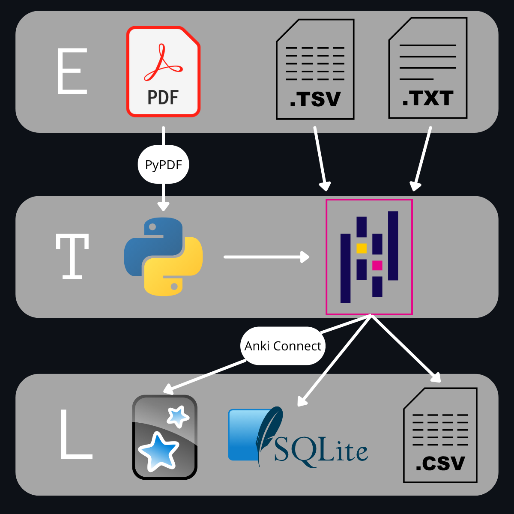

# ETL from pdf files 👷🏼 (WIP)
Avg exam -> 8 mins

Total 34 pdfs

## Summary

## Table of Contents

* [Motivation](#motivation)
* [Technologies and Tools Used](#technologies-and-tools-used)
* [Project Architecture](#project-architecture)
    * [Initial considerations](#initial-considerations)
    * [Extract](#extract)
    * [Transform](#transform)
    * [Load](#load)
* [Instalation and Usage](#instalation-and-usage)
* [What I Learned](#what-i-learned)
* [Potential Improvments](#potential-improvments)

## Motivation

As a self-studying candidate for the Internal Resident in Biology (BIR) exam, I faced the daunting task of efficiently reviewing a vast number of exam questions in PDF format. The tedious process of manual review quickly became a significant hurdle. To overcome this, I developed an ETL pipeline to automate the extraction and organization of these questions, seamlessly integrating them into Anki for streamlined and effective study sessions. This project transformed my exam preparation from a laborious chore into a personalized and efficient learning experience. For this, I explored various PDF text extraction methods and selected the open-source `pypdf` library for its user-friendly nature. Data manipulation and cleaning were accomplished using `pandas`, the gold standard in Python's data science ecosystem.

## Technologies and Tools Used

This project leverages the following technologies and tools:

* **Programming Language:** Python 3.12
* **Development Enviroment:** Jupyter Notebooks - Used for interactive development.
* **PDF Extraction**: PyPDF 5.3.0 - Used to extract content from PDF files.
* **Data Manipulation**: Pandas 2.2.2 - Used for data cleaning and transformation.
* **Data Manipulation**: Numpy 1.26.4 - Used for data cleaning.
* **Database:** SQLite3 - Used to store data in a relational database.
* **Anki Integration:** Anki Connect - To connect with Anki using an API.

## Project Architecture

### Initial considerations

Early in the development process, I encounteres several challenges related to the variability of the PDF files. Each PDF presented unique issues, including:

* **Artifacts:** Page numbers and other elements often appeared as artifacts within the extracted text, requiring careful filtering and removal. For example, some PDFs consistently placed page numbers within the content area, while others had inconsistent placement.
* **Truncated Lines:** Questions were often split across multiple lines due to the two column format of the original PDFs. These truncated lines needed to be intelligently joined to ensure accurate parsing and interpretation. Some common patterns included hyphens at the end of lines and inconsistent spacing between words.

Furthermore, I discovered two distinct answer sheet formats used in the exams, each requiring a different parsing approach. The exams from 2024 to 2018 the answers file were a tsv file structured in three columns with the column names "V" and "RC", and the exams from 2017 or previous had the answers as txt files separated with spaces with a single column containing in one row the number of question and the row below the correct option. Another difernce between the two ansers formats where that in the tsv file the anulated questions were marked with missing values, and in the txt file were marked with the letter "A". To address this, I developed two separate templates to accommodate these variations.

Finally, the number of answer options changed from five to four starting in 2015. This meant that I needed to create a third teplate to handle exams from 2015 onwards.

These challenges highlighted the need for a flexible and adaptable solution capable of handling the nuances of different PDF formats and exam structures. The main logic for the exam questions was the same for all exams, only modifing it to remove certain artifacts. For the anwsers, I implemented two distinc ways to parse and slice the answers data to get a Dataframe with only two columns one with number of the quesiton the other the correct option, ensuring accurate extraction and processing of the exam questions.

### Extract

Using the oper source library PyPdf reads the exam pdf and the output is piped into a dataframe

For the answers sheet can be either in tsv format, or txt with spaces as separator. The extraccion is done with Pandas directly using the .read_table function

Depending if the answers sheet is in tsv or txt format the type 1 or 2 will be used.

### Transform

The questions using pandas will remove all the artifacts, like page numbers or others, and white spaces. Once all artifacts are gone a function to deal with multines will be used, it checks if a line ends with "-" for truncated words and to detect if the next line is a question or options the function checks if the first element of the next line can be converted into an integer.

Once this script is done it counts the number of lines that do not end with a dot, comma or interrogation and generates a list of ids to fix. The length lf this list will be compared with the theoretical number of incorrect rows that is calculated with the following formula number of questions * number of options - length of the dataframe. If the number of expected errors matches with the length of ids to fix it applies a second function to fix them, if there are more or less than expected prints +/- 2 rows for context and raises a Warning, so i could manualy check for the rows to fix.

Another check is done once the fix is applied and if the number of rows is not equal to the expected it raises a Warning to check it manually.

Once all the checks are done the dataframe is pivoted to get the following columns: 

* Question
* Option 1
* Option 2
* Option 3
* Option 4
* Option 5 if needed

For the anwers dataframe the transform step it will depend if it comes from tsv file or txt.

### Load

#### csv files

The clean data was first saved to individual csv files, as a backup, and to fix spacing issues like "T h i s  i s  a n  e x a m p l e" that were faster and easier to fix in a csv file and then from the csv file read it with pandas and load into the database

Finally once all the data was stored in the database before loading the data into Anki it was saved into a csv file containing all the exams.

#### SQLite3
Database Schema

#### Anki

The Anki deck can be found either in the data/clean folder or in [AnkiWeb](https://ankiweb.net/shared/info/1201513810?cb=1741085089356)

Each card has the following structure:
* Year number and three leter abreviation of the exam for easy identification of the question
* Quesion statement followed by three line breaks for easy redability
* Quesion options with two line breaks in between options for easy redability

The target tags have the following hierarchy:
* "Examenes" as the parent tag 
    * Exam Type (BIR, FIR, QIR, MIR)
        * Exam Year (2024 - 2005)

## Instalation and Usage

## Example output

### Raw DataFrame extracted from PDF files:

### Clean DataFramse with answers:

### In Anki:

### In csv file:

### In SQLite3 database: 

Question Table

Options table

## What I Learned

* Cuando escribes a una db añadir suficientes constraints, ya que si dos preguntas tienen el mismo enunciado puede causar problemas, asi que añadir mas constraints como año o tipo de examen.
* Use pandas and numpy to manipulate and clean data.
* Implement validation steps in the pipeline.

## Potential Improvments

* A better heuristic or a new way to detect and fix truncated lines so there is no need for manual checking.